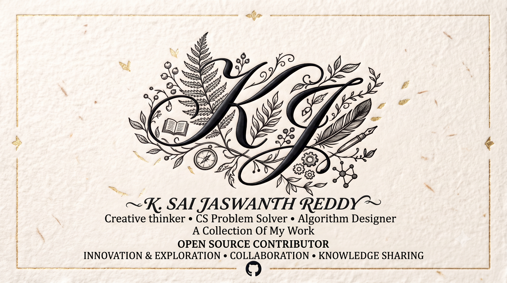

<p align="center">
  
</p>

# Hi, I'm Jaswanth 👋

<p align="left">
  <a href="https://github.com/Jaswanth1902"></a>
</p>

> **Creative Thinker • CS Problem Solver • Algorithm Designer • Open-Source Contributor**  
> Almost everything I know about computer science, software engineering, and systems was taught to me by the global open-source community. Now, I'm taking my first humble steps into giving back — building thoughtful, lightweight tools aimed at improving everyday Quality of Life (QOL) for developers and daily computer users.

<p align="left">
  <a href="https://github.com/Jaswanth1902"></a>
  <a href="https://github.com/Jaswanth1902?tab=repositories"></a>
  <a href="mailto:jaswanthreddy1537@gmail.com"></a>
  <a href="https://www.linkedin.com/in/kannali-sai-jaswanth-reddy-aa3678337/"></a>
</p>

---

## 💡 Why I Build: Improving Everyday QOL

I believe software should be fast, accessible, and respectful of your machine's hardware. Too many modern desktop and AI tools feel bloated, complicated, or locked behind expensive subscriptions. My work is anchored by **three sovereign flagships**, each built from first principles to solve a concrete everyday friction:

```
┌────────────────────────────────────────────────────────────────────────────────────────┐
│                              THE 3 SOVEREIGN FLAGSHIPS                                 │
├──────────────────────────┬─────────────────────────────┬───────────────────────────────┤
│          NOTCH           │         CARTOGRAPH          │        AI NOVEL WRITER        │
│   (Native Desktop HUD)   │     (AST Memory Engine)     │     (Creative Intelligence)   │
├──────────────────────────┼─────────────────────────────┼───────────────────────────────┤
│ • Win11 Dynamic Island   │ • Zero-dependency MCP server│ • 1,275-node SQLite graph     │
│ • 0.0% Idle CPU          │ • Cuts tokens by >90%       │ • 100 master authors lineage  │
│ • <25 MB RAM consumption │ • Sub-10ms query latency    │ • Gardner psychic distance    │
│ • Shift+Enter approval   │ • Standard library AST      │ • Automated AST quality gates │
│ • PowerShell / Win32 C#  │ • Python / SQLite WAL       │ • Python / SQLite / NetworkX  │
└──────────────────────────┴─────────────────────────────┴───────────────────────────────┘
```

### 🏝️ 1. [Notch](https://github.com/Jaswanth1902/Notch) — Native Windows 11 Dynamic Island & Agent HUD
*Why should macOS have all the sleek ambient desktop widgets while Windows users are stuck with 200MB background Electron wrappers?*  
- **The Problem**: Desktop agent indicators either hijack user focus or sit hidden in the taskbar notification tray.
- **The Solution**: An ambient, bezel-flush Dynamic Island built natively in PowerShell, WPF, and Win32 C#.
- **Performance**: **0% idle CPU** and `<25MB RAM`, with a global `Shift+Enter` system hook allowing users to approve autonomous tool executions without window focus changes.

### 🗺️ 2. [Cartograph](https://github.com/Jaswanth1902/Omnia-codebase-memory) — AST Codebase Mapmaker & MCP Memory Server
*Why should coding assistants burn 40% of their context windows grepping raw text files?*  
- **The Problem**: File-search tools flood LLM prompts with redundant text chunks, increasing latency and triggering hallucinated imports.
- **The Solution**: A zero-dependency Model Context Protocol (MCP) server that parses repository structures via native Python AST.
- **Performance**: Returns deterministic symbol graphs in **under 10 milliseconds**, cutting agent token burn by **over 90%**.

### 🖋️ 3. [AI_Novel_Writer](https://github.com/Jaswanth1902/AI_Novel_Writer) — Computational Literary Craftsmanship Engine
*Why does generative AI fiction produce repetitive purple prose, filter verbs, and amnesiac narrative arcs?*  
- **The Problem**: Autoregressive models lack structural pacing memory and drift into generic AI writing tropes.
- **The Solution**: A 5-stage narrative simulation engine powered by a **1,275-node SQLite knowledge graph** mapping the stylistic DNA and pacing techniques of 100 master authors.
- **Craftsmanship**: Features John Gardner psychic distance calibration and automated AST anti-slop gates that halt generation if filter verbs or cliches exceed thresholds.

---

## 🏛️ Open-Source Systems & Research Vault

In addition to the three sovereign flagships, I maintain open-source implementations across low-level systems, clinical machine learning, and computational geometry:

| Repository | Focus Area | Technical Highlight | Tech Stack |
| :--- | :--- | :--- | :--- |
| 🎓 **[-Academic-ideation-platform](https://github.com/Jaswanth1902/-Academic-ideation-platform)** | Research Ideation | Semantic citation graph explorer with local Ollama models | React 18, Vite, Python, Ollama |
| 🔐 **[SecureX](https://github.com/Jaswanth1902/SecureX)** | Applied Cryptography | Zero-knowledge AES-256-GCM vault with PBKDF2 key derivation | Python, Cryptography, SQLite |
| 🤖 **[Autism_Screening_Agent](https://github.com/Jaswanth1902/Autism_Screening_Agent)** | Clinical Diagnostics | AQ-10 behavioral screening tree with SHAP explainability | Streamlit, Gemini API, ReportLab |
| ⚡ **[DAA_EL](https://github.com/Jaswanth1902/DAA_EL)** | Computational Geometry | In-browser Delaunay image triangulation with 3D OBJ export | Vanilla JS, Web Workers, Canvas |
| 🏥 **[Hospital-Database](https://github.com/Jaswanth1902/Hospital-Database)** | Database Architecture | 3NF relational clinical schema with ACID transaction isolation | PostgreSQL 14+, Node.js, Express |
| 🧬 **[BIO-TECH](https://github.com/Jaswanth1902/BIO-TECH)** | Bioinformatics | Genomic FASTA sequence parser and CRISPR locus visualizer | Solidity, Web3.py, Flask, RAG |
| ⚡ **[Queue-Drop](https://github.com/Jaswanth1902/Queue-Drop)** | Distributed Systems | Token-bucket rate limiting with dead-letter queue isolation | Python 3.10+, AsyncIO |
| 🔨 **[Z_Forge](https://github.com/Jaswanth1902/Z_Forge)** | Systems Benchmarking | Dual C99 and Python LZW compression algorithm profiler | C99 Native, Python 3, ctypes |

---

## 🌱 Engineering & Design Philosophy

- **The Atelier Aesthetic Canvas**: Classical editorial typography (*Cinzel*, *Cormorant Garamond*), Renaissance Da Vinci conceptual linework, warm archival parchment, and burnished gold accents. Zero corporate neon gradients.
- **Emil Kowalski Component Physics**: Tactile `:active` depression (`scale(0.97)`), organic materialization (`scale(0.95)` to `scale(1)`), custom cubic-bezier easing (`cubic-bezier(0.23, 1, 0.32, 1)`), and strict property targeting (zero `transition: all`).
- **Open-Source Reciprocity**: The open-source community gave me the tools to learn computer science. Every repository I build is documented, reproducible, and released openly to help the next learner.

---

## 📊 Activity & Telemetry

<div align="center">
  <a href="https://github.com/Jaswanth1902">
    
    
  </a>
</div>

---

## 📬 Say Hello!

I'm always open to ideas, feedback, and collaborating on systems engineering:
- **Email**: [jaswanthreddy1537@gmail.com](mailto:jaswanthreddy1537@gmail.com)
- **LinkedIn**: [Kannali Sai Jaswanth Reddy](https://www.linkedin.com/in/kannali-sai-jaswanth-reddy-aa3678337/)
- **GitHub**: [github.com/Jaswanth1902](https://github.com/Jaswanth1902)
